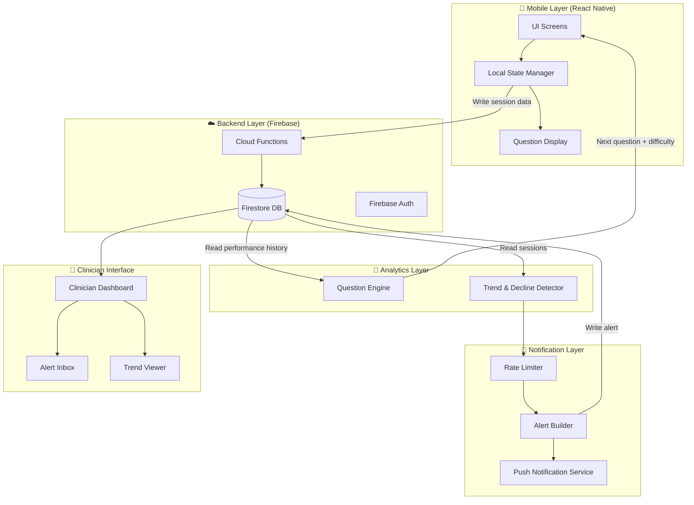
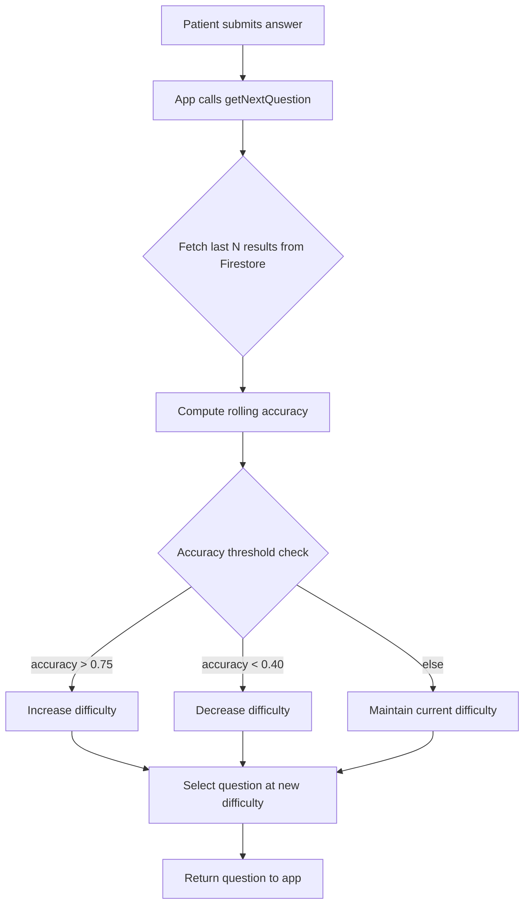
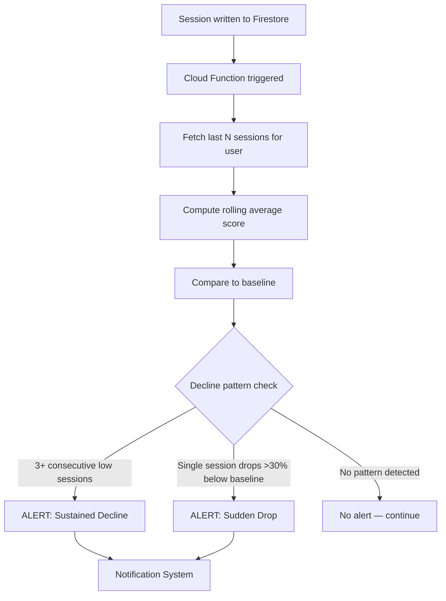
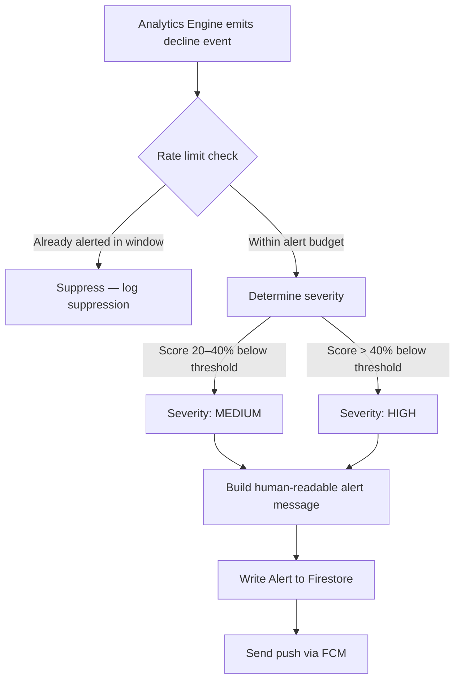
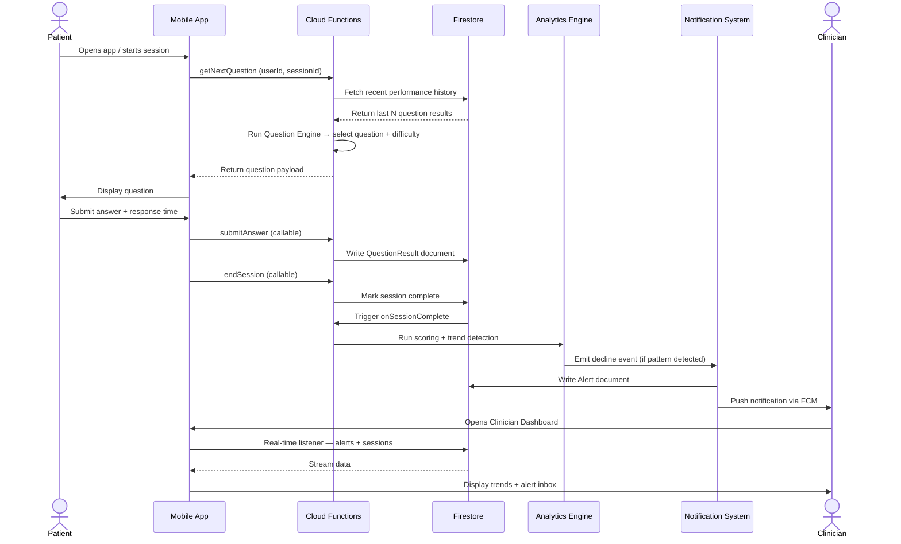
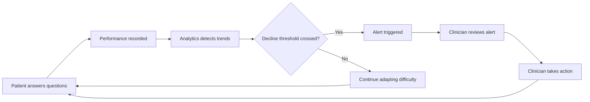
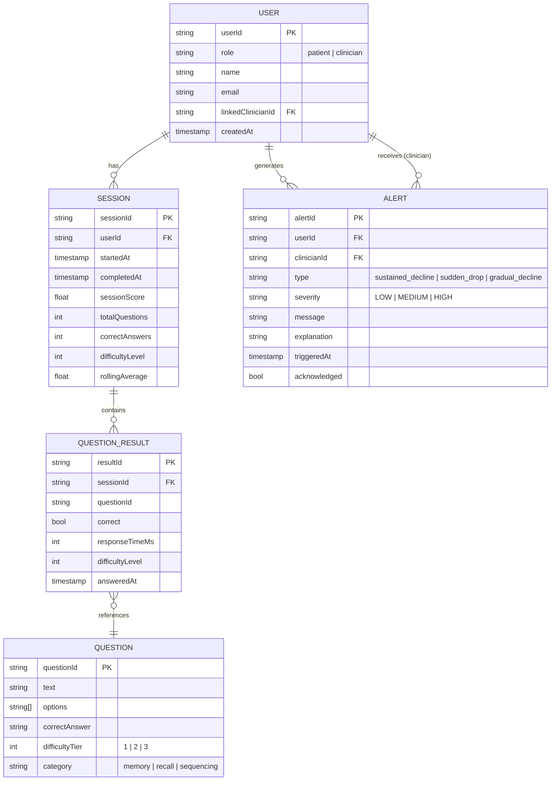

# CareMind AI — Software Architecture Document

**Project:** Dementia Support AI Application
**Version:** 1.0 (Draft)
**Date:** 2026-03-17
**Status:** Draft — For Academic Review

---

## Table of Contents

1. [Executive Summary](#1-executive-summary)
2. [Problem Domain & Content Model](#2-problem-domain--content-model)
3. [System Overview](#3-system-overview)
4. [Architecture Overview](#4-architecture-overview)
5. [Technology Stack](#5-technology-stack)
6. [Core Component Breakdown](#6-core-component-breakdown)
7. [Data Flow](#7-data-flow)
8. [Data Model](#8-data-model)
9. [API Structure](#9-api-structure)
10. [Design Rationale](#10-design-rationale)
11. [Validation Plan](#11-validation-plan)
12. [Constraints & Future Enhancements](#12-constraints--future-enhancements)

---

## 1. Executive Summary

CareMind AI is a mobile-first cognitive support application for dementia patients. It delivers adaptive cognitive exercises that respond in real time to a patient's performance, tracks longitudinal performance trends, and proactively notifies clinicians when meaningful cognitive decline is detected.

The system is architected as a **closed-loop, event-driven intelligent system** with clean separation between:
- The patient-facing experience (adaptive exercise delivery)
- The analytics engine (trend detection and scoring)
- The clinician-facing interface (monitoring, alerts, trends)

The design prioritizes **explainability over complexity** — rule-based logic is used throughout instead of black-box ML models, making the system suitable for clinical review and academic validation.

---

## 2. Problem Domain & Content Model

### 2.1 Clinical Context

Dementia progressively impairs a person's ability to recall information, orient themselves in time and place, sustain attention, and perform multi-step reasoning. Regular cognitive exercise can help slow functional decline and provides a measurable signal of how a patient is doing between clinical visits.

CareMind AI delivers short daily exercise sessions (5–10 questions) across the cognitive domains most commonly affected by early-to-mid stage dementia. The questions are not diagnostic tools — they are structured exercises that generate a longitudinal performance signal useful to clinicians.

### 2.2 Cognitive Domains

The question bank covers four domains:

| Domain | What It Tests | Example |
|--------|--------------|---------|
| **Orientation** | Awareness of time, date, place | "What year is it?" / "What season are we in?" |
| **Short-term Recall** | Ability to retain and retrieve recently presented information | "Earlier you were shown 3 words. What were they?" |
| **Attention & Working Memory** | Ability to hold and manipulate information | "Count backwards from 20 by 2s." / "What is 100 minus 7?" |
| **Language & Naming** | Word retrieval and object recognition | "What is this object called?" (shown an image of a clock) |

### 2.3 Question Structure

Every question is a multiple-choice item with 4 options and one correct answer. This format is chosen for simplicity (no keyboard required), speed (fast to answer on mobile), and easy automated scoring (correct / incorrect — no ambiguity).

```
Question:  "What month comes after July?"
Options:   A) June   B) August   C) September   D) October
Answer:    B
Domain:    Orientation
Difficulty: Tier 1
```

### 2.4 Difficulty Tiers & Content Logic

Questions are authored at three difficulty tiers. Difficulty is determined by the **cognitive load** required to answer — not by topic. A question about orientation can be easy or hard depending on how much reasoning it requires.

| Tier | Label | Cognitive Load | Example |
|------|-------|---------------|---------|
| **1** | Easy | Direct recall, single-step | "What day of the week is it?" |
| **2** | Medium | Short delay, mild inference | "What were the 3 words shown 2 minutes ago?" |
| **3** | Hard | Multi-step reasoning, abstraction | "If today is Wednesday and your appointment is in 4 days, what day is it?" |

The system always draws the next question from the **current difficulty tier**. Within a tier, questions are selected randomly from the bank to avoid repetition within a session.

### 2.5 Scoring & Adaptive Algorithm

**Per-question scoring** is binary:

```
correct answer  → 1 point
wrong answer    → 0 points
```

Response time is recorded but does not affect the score in v1 — it is stored for future analysis only.

**Session score** is the percentage of correct answers:

```
sessionScore = correctAnswers / totalQuestions   (expressed as 0.0 – 1.0)
```

**Difficulty adjustment** is computed by the Question Engine after every answer, using a rolling window of the last 5 answers (within the current session or spanning recent sessions):

```
rollingAccuracy = sum(correct answers in last 5) / 5

IF rollingAccuracy > 0.75  →  difficulty += 1   (patient is doing well, increase challenge)
IF rollingAccuracy < 0.40  →  difficulty -= 1   (patient is struggling, reduce load)
ELSE                        →  difficulty unchanged

Difficulty is clamped to [1, 3]
```

This means:
- A patient must answer 4 out of their last 5 questions correctly before the system promotes them to a harder tier.
- A patient must miss 3 out of their last 5 before the system steps them down.
- The middle band (40%–75%) is intentionally wide — stability is preferred over constant jumping.

**Baseline** is established from the first 5 completed sessions and used by the Analytics Engine for long-term decline detection (separate from the per-question rolling window).

---

## 3. System Overview

### 2.1 Goals

| Goal | Description |
|------|-------------|
| Adaptive Exercises | Questions adjust dynamically to each patient's real-time performance |
| Longitudinal Tracking | Performance trends tracked across sessions, not just within a single session |
| Decline Detection | Sliding-window analytics detect gradual and sudden performance drops |
| Clinician Alerts | Smart notifications with rate-limiting, severity levels, and human-readable explanations |
| Interpretability | Every system decision (difficulty change, alert trigger) can be explained in plain language |

### 2.2 User Roles

| Role | Description | Primary Interface |
|------|-------------|-------------------|
| Patient | Daily cognitive exercises; primary end user | Mobile App |
| Clinician | Monitors patient performance; receives and reviews alerts | Clinician Dashboard |

---

## 4. Architecture Overview

The application follows a **layered modular architecture** with five distinct layers. Each layer communicates through well-defined interfaces, allowing components to be replaced or upgraded independently.



---

## 5. Technology Stack

| Layer | Technology | Justification |
|-------|-----------|---------------|
| Mobile App | React Native (Expo) | Cross-platform (iOS + Android); fast prototyping |
| Backend / Database | Firebase Firestore | Real-time sync; schema-flexible; no server management required |
| Authentication | Firebase Auth | Built-in; supports anonymous + email auth |
| Serverless Logic | Firebase Cloud Functions (Node.js) | Triggers on Firestore writes; ideal for analytics + notification logic |
| Push Notifications | Firebase Cloud Messaging (FCM) | Native integration with Firebase stack |
| Analytics Engine | TypeScript / Cloud Functions | Rule-based logic; co-located with backend for low latency |
| Clinician Dashboard | React Native screen or React web app | Shared component logic with mobile app |
| State Management | Zustand or React Context | Lightweight; appropriate for prototype scale |

---

## 6. Core Component Breakdown

### 5.1 Mobile App (React Native)

The app is the patient's primary touchpoint — deliberately thin, rendering questions and capturing answers while delegating all logic to the backend.

**Screens:**

| Screen | Responsibility |
|--------|----------------|
| `LoginScreen` | (Optional) Email or anonymous sign-in via Firebase Auth |
| `QuestionScreen` | Displays current question; captures answer + response time |
| `ResultScreen` | Shows session summary (score, accuracy, encouragement message) |
| `ClinicianDashboard` | Trend charts and alert inbox — restricted to clinician role |

No difficulty logic lives in the app. All adaptation decisions are made by the Question Engine on the backend. Local state is ephemeral; all persistence goes through Firebase.

### 5.2 Question Engine

The Question Engine runs as an **HTTP callable Cloud Function** invoked by the app after each answer submission. It selects the next question and adjusts difficulty based on recent performance.



**Difficulty Tiers:**

| Tier | Label | Description |
|------|-------|-------------|
| 1 | Easy | Simple recall, single-step tasks |
| 2 | Medium | Multi-step recall, basic sequencing |
| 3 | Hard | Abstract reasoning, delayed recall |

**Adaptation Rules:**

```
IF rolling_accuracy(last 5 answers) > 0.75 → difficulty += 1
IF rolling_accuracy(last 5 answers) < 0.40 → difficulty -= 1
ELSE → difficulty unchanged
Difficulty clamped to [1, 3]
```

### 5.3 Analytics Engine (Trend & Decline Detector)

The Analytics Engine runs as a **Firestore-triggered Cloud Function** on session completion. It computes a session score (`correctAnswers / totalQuestions`), updates the rolling average, and evaluates longitudinal decline patterns.



**Metrics Tracked Per Session:**

| Metric | Description |
|--------|-------------|
| `sessionScore` | Percentage of correct answers in session |
| `difficultyLevel` | Difficulty tier active during session |
| `rollingAverage` | Mean score across last N sessions |
| `baselineScore` | Mean score of first M sessions (calibration window) |

**Detection Patterns:**

| Pattern | Trigger Condition |
|---------|------------------|
| Sustained Decline | `sessionScore < low_threshold` for 3+ consecutive sessions |
| Sudden Drop | `sessionScore < baseline * 0.70` (30% drop from baseline) |
| Gradual Decline | Negative slope of rolling average over 7 sessions |

### 5.4 Notification System

The Notification System evaluates decline alerts and delivers them to clinicians via push notification. It runs as part of the analytics pipeline after a decline pattern is confirmed.



**Alert Severity Levels:**

| Level | Trigger | Example Message |
|-------|---------|-----------------|
| LOW | Single below-average session | "Patient had a below-average session today." |
| MEDIUM | 2 consecutive low sessions | "Patient scored below threshold for 2 sessions in a row." |
| HIGH | 3+ consecutive low sessions or sudden drop | "Significant decline detected: 3 consecutive low scores. Review recommended." |

**Rate Limiting:**
- Max 1 HIGH alert per patient per 12 hours
- Max 1 MEDIUM alert per patient per 24 hours
- LOW suppressed if MEDIUM/HIGH sent in the same window

Every alert includes an `explanation` field with the exact scores and baseline that triggered it — no alert is dispatched without a human-readable reason.

---

## 7. Data Flow

### 6.1 Patient Exercise Flow



### 6.2 Closed-Loop System Flow



---

## 8. Data Model

All data is stored in Firebase Firestore using a document-collection structure.



**Firestore Collection Structure:**

```
/users/{userId}
  /sessions/{sessionId}
    /questionResults/{resultId}
/questions/{questionId}
/alerts/{alertId}
```

---

## 9. API Structure

All backend logic runs as Firebase Cloud Functions — no traditional REST server. All app writes go through **callable functions** to ensure validation and consistency; Firestore triggers are used only for reactive processing.

### 8.1 Callable Functions (App → Backend)

| Function | Input | Output | Description |
|----------|-------|--------|-------------|
| `startSession` | `{ userId }` | `{ sessionId }` | Creates a new session document |
| `getNextQuestion` | `{ userId, sessionId }` | `{ question, difficultyLevel }` | Runs Question Engine; returns next adaptive question |
| `submitAnswer` | `{ sessionId, questionId, correct, responseTimeMs }` | `{ ok }` | Writes QuestionResult to Firestore |
| `endSession` | `{ sessionId }` | `{ sessionScore, summary }` | Marks session complete; triggers analytics |
| `getPatientTrends` | `{ userId, limit }` | `{ sessions[], alerts[] }` | Returns session history for dashboard |
| `acknowledgeAlert` | `{ alertId }` | `{ ok }` | Marks alert as reviewed by clinician |

### 8.2 Firestore-Triggered Functions (Reactive)

| Function | Trigger | Description |
|----------|---------|-------------|
| `onSessionComplete` | `sessions/{sessionId}` — `completedAt` set | Runs Analytics Engine; computes rolling metrics; evaluates decline patterns |
| `onAlertCreated` | `alerts/{alertId}` — on create | Sends FCM push notification to linked clinician |

---

## 10. Design Rationale

| Decision | Rationale |
|----------|-----------|
| **Rule-based analytics over ML** | ML models are black boxes — inappropriate for clinical settings where every decision must be auditable. Rule-based logic produces deterministic, explainable outcomes. |
| **Firebase over custom backend** | Reduces infrastructure scope for a prototype. Firestore's real-time capabilities and Cloud Functions are sufficient for this scale. |
| **React Native** | Single codebase targets both iOS and Android. Shared component logic with any web-based clinician dashboard if built in React. |
| **Event-driven analytics** | Analytics run reactively on session write rather than on a polling schedule. Ensures alerts are generated immediately after session completion with minimal compute cost. |
| **Modular layer separation** | Each layer can be modified independently — e.g. the Question Engine's thresholds can be tuned without touching the notification system. |
| **Difficulty clamped to 3 tiers** | Simple tiers keep system behavior predictable and testable. A continuous score was rejected as it would complicate validation. |
| **Explainability as a hard requirement** | Clinicians must be able to act on alerts without interpreting raw data. Every alert includes a plain-language explanation of what triggered it. |

---

## 11. Validation Plan

The system will be validated using **simulated patient data** — no real patient data is used.

### 10.1 Test Scenarios

| Scenario | Description | Expected Outcome |
|----------|-------------|-----------------|
| Stable Performance | Patient scores 65–80% across 15 sessions | No alerts triggered; difficulty adjusts upward |
| Gradual Decline | Scores drop 5% per session over 10 sessions | MEDIUM alert after 2 low sessions; HIGH after 3 |
| Sudden Drop | 72% average drops to 30% in one session | HIGH alert triggered on session completion |
| Recovery After Decline | Patient declines then recovers | Alert suppressed after recovery |
| Rate Limit Test | Multiple low sessions in rapid succession | Only 1 alert per window dispatched |

### 10.2 Key Metrics

| Metric | Target |
|--------|--------|
| Alert Precision (alerts matching real simulated decline) | > 90% |
| Alert Recall (decline events that trigger an alert) | > 85% |
| Adaptation Responsiveness (sessions until difficulty adjusts) | ≤ 3 sessions |

---

## 12. Constraints & Future Enhancements

### 11.1 Current Constraints

| Constraint | Detail |
|------------|--------|
| No real patient data | All testing uses simulated data only |
| Prototype scope | Not designed for clinical deployment or regulatory compliance (HIPAA, etc.) |
| Simple auth | Role separation implemented but not hardened |
| Rule-based only | No ML model training or inference pipeline |

### 11.2 Future Enhancements

| Feature | Description |
|---------|-------------|
| Clinician threshold tuning | Allow clinicians to adjust alert thresholds per patient |
| ML-based trend detection | Augment rule-based detection with time-series anomaly detection |
| Multi-patient dashboard | Clinician view across all assigned patients |
| HIPAA compliance layer | Encryption at rest, audit logging, BAA with Firebase |

---

*Document prepared for academic review. All architecture decisions reflect prototype-level constraints and are subject to revision based on consultation feedback.*
